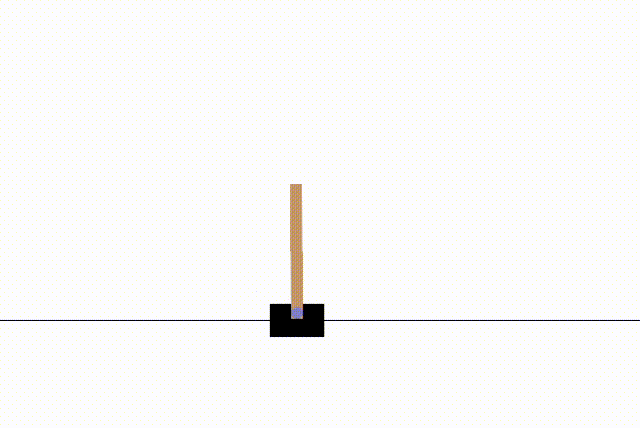

# CartPole-v1 PPO Agent(Reinforcement Learning Project)

## Description
This project implements a reinforcement learning agent using the PPO algorithm to solve the CartPole-v1 envionment from OpenAI Gym.The implementation is based on the Stable-Baseslines3 library.
the objective  is to balance a pole on a cart by applying forces to the left or right.

Episode1: Reward = 993.0
Episode2: Reward = 688.0
Episode3: Reward = 2157.0
Episode4: Reward = 457.0
Episode5: Reward = 872.0
Episode6: Reward = 763.0
Episode7: Reward = 458.0
Episode8: Reward = 1397.0
Episode9: Reward = 1083.0
Episode10: Reward = 2008.0
Rewards of 10 Episodes: 1087.6 ± 565.7766697204826
## Output

## Requirements
To run this project, you need to have the following requirements installed:
#Python
#gymnasium
#stable_baselines3

