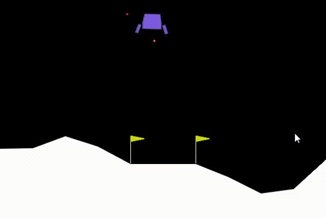

# LunarLander-v3 PPO Agent(Reinforcement Learning Project)

## Description
This project implements a reinforcement learning agent using the PPO algorithm to solve the LunarLander-v3 envionment from OpenAI Gym.The implementation is based on the Stable-Baseslines3 library.
the objective  is to land a spacecraft safetly between two flags by controlling the engines to reduce speed and stabilze orientation.

## Output

## Requirements
To run this project, you need to have the following requirements installed:

Python
gymnasium
stable_baselines3

